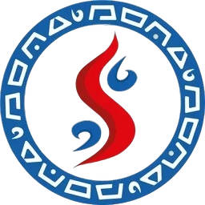

  

# Projeto Iandê

> O Projeto Iandê visa coletar dados sobre os canais de Belém por meio de barragens ecológicas, a fim de proporcionar uma melhor qualidade de vida para a população.

---

## Objetivos do Projeto

- [ ] Instalar barragens ecológicas nos canais de Belém.
- [ ] Coletar dados sobre enchentes e quantidades de lixo nos canais.
- [ ] Chegar em soluções viáveis e sustentáveis para essas problemáticas.

---

## Diferenciais da Proposta

- Monitoramento em tempo real de dados como nível da água e peso do lixo.
- Uso de materiais sustentáveis e energia renovável.
- Coleta de dados que não são transparentes ou escassos para a população.
  
---

## Contato

| Nome | E-mail |
|------|--------|
| Evellyn Ribeiro (Líder) | evellyn24300080@aluno.cesupa.br |
| Analice Alves | analice24070032@aluno.cesupa.br |
| Rafael Diniz  | rafael24300105@aluno.cesupa.br |
| Paulo Ricardo | paulo24070023@aluno.cesupa.br |
| Cauã Marchiotto | caua24300104@aluno.cesupa.br |
| João Pedro | joao24070024@aluno.cesupa.br |
| Pierre Mattar | pierre24270326@aluno.cesupa.br |
| Nathalia Gama | nathalia24070093@aluno.cesupa.br |
| Davi Severino | davi24290007@aluno.cesupa.br |

